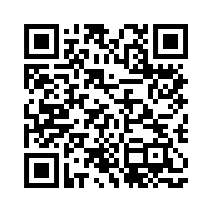

# 2023 PSU Statistics Dept Research Day

*February 3, 2023*

## Statistics & Data Science Education Research Interests

#### Educational Assessment

  - **developing and analyzing tools** intended to measure specific learning outcomes, etc. Novel approaches to educational measurement.
  - "tests" for research use across academic institutions; e.g., **intro data science**, intro **statistics**, **capstone assessment** just before graduation in statistics
  - formative assessment; e.g., feedback for self-regulated learning and/or adaptive instruction

see, e.g., Lloyd, S. E., Beckman, M., Pearl, D., Passonneau, R., Li, Z., & Wang, Z. (2022). Foundations for AI-Assisted Formative Assessment Feedback for Short-Answer Tasks in Large-Enrollment Classes. In *Proceedings of the eleventh international conference on teaching statistics*. Rosario, Argentina.

#### Teaching & Learning

  - **mechanisms to promote efficient learning** outcomes
  - cognitive transfer, i.e., flexible/portable learning to be applied beyond the classroom
  - cognitive load, i.e., stresses on student bandwidth during learning processes

see, e.g., Beckman, M. D., & delMas, R. C. (2018). Statistics students' identification of inferential model elements within contexts of their own invention. *ZDM Mathematics Education 50*(7). DOI: 10.1007/s11858-018-0986-5

#### Data Science Education

  - exploring intersection of stat education & computing education
  - studying **DS/CS topics introduced as learning objectives in statistics** curricula
  - Data literacy, data acumen, EDA for DS

see, e.g., Beckman, M. D., Cetinkaya-Rundel, M., Horton, N. J., Rundel, C. W., Sullivan, A. J., & Tackett, M. (2021). Implementing Version Control With Git and GitHub as a Learning Objective in Statistics and Data Science Courses. *Journal of Statistics and Data Science Education, 29*(1). https://doi.org/10.1080/10691898.2020.1848485

#### Curious?

  - Talk to me! Take a photo of QR code below, email me, drop by to chat
  - Visit SDSE Research Lab--meets Wed @ 9am in 421 Thomas Bldg (SP23)
  - [CAUSE Research Satellite @ USCOTS: 5/31 - 6/1 @ Penn Stater Conference Center (link)](https://www.causeweb.org/cause/uscots/uscots23)
  - [IASE catalog of PhD dissertations in statistics education (link)](https://iase-web.org/Publications.php?p=Dissertations)

## Contact

Matthew Beckman  
Assoc Research Professor  
Department of Statistics  

office: 421C Thomas Building  
email: mdb268 [at] psu [dot] edu  
webpage: <https://mdbeckman.github.io/>
